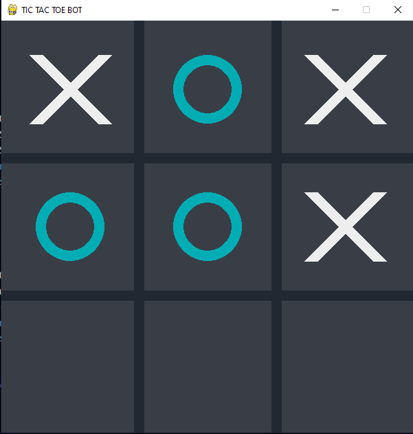
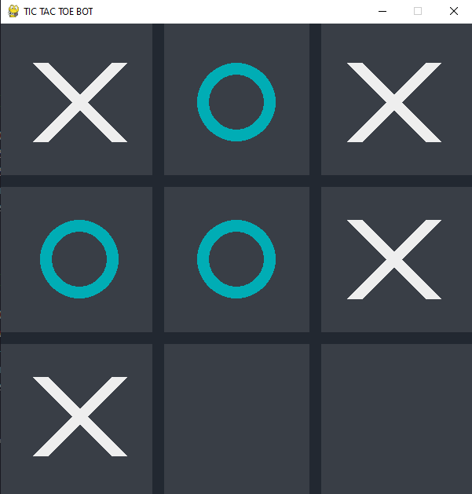

# TicTacToe Unbeatable AI
A Tic Tac Toe unbeatable AI project involves creating a computer program that can play Tic Tac Toe against a human player and is designed to never lose.
The game is played on a 3x3 grid, and the goal is to get three in a row in any direction (horizontal, vertical, or diagonal).

# MiniMax Algorithm
for make that AI unbeatable i use the Minimax Algorith

Minimax is a decision-making algorithm commonly used in game theory and artificial intelligence to determine the optimal move for a player in a turn-based game. It is particularly useful for two-player games with perfect information, such as Tic Tac Toe, chess...

The basic idea behind the minimax algorithm is to consider all possible moves that can be made by both players and choose the move that maximizes the AI player's chance of winning, while minimizing the opponent's chance of winning. This is done by recursively evaluating the possible outcomes of each move and selecting the move that leads to the best outcome for the AI player.

# Example :
- X : Going to Maximize
- O : Going to Minimize

- Give -1 if the AI win
- Give 1 if The AI Lose
- Give 0 if we have a draw

### intial Board
{:width="400px"}
the next move is 'X' move and we have 3 choses
The AI try all this choses and (every move equal to a different board)

### chose 1 

# Game Instructions
- press 'g' to change gamemode (pvp or ai)
- press '0' to change ai level (easy or unbeatable)
- press 'r' to restart the game
- press 'p' to change who start (Player or AI)

# Image

